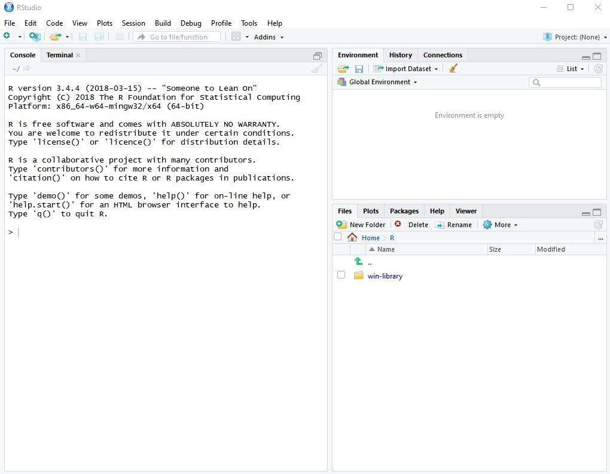

# BU-dataviz-workshop-2019
Installation instructions and needed files for students at the intro to data visualization in R Data + Narrative session June 6

## Installation instructions

Here's how to get your system ready for the workshop!

1. **Download and install R** from the project's home page at [https://www.r-project.org/](https://www.r-project.org/). This works like installing most software applications on either Windows or Mac. 

2. **Download and install the RStudio IDE** (Integrated Development Environment) from RStudio at [https://www.rstudio.com/products/rstudio/download/](https://www.rstudio.com/products/rstudio/download/). You want the free, open-source desktop version for your operating system. An IDE makes it easier to write code compared with using a plain text editor or command line tool.   Andrew Tran (Washington Post) has some online instructions with a couple of screen shots for [installing R](https://learn.r-journalism.com/en/introduction/installing_r/installing-r/) and [RStudio](https://learn.r-journalism.com/en/introduction/installing_rstudio/installing-rstudio/) if you get stuck.

3. Open RStudio and it should look something like this.

4. On your console's command line -- where that `>` is on the left -- type `install.packages("usethis")` and hit enter. That will install your first R add-on package.   If you would like to know a little bit more about using the RStudio IDE, I have a very quick introduction available free online from my book, Practical R for Mass Communication and Journalism, at [http://www.machlis.com/R4Journalists/a-brief-introduction-to-rstudio.html](http://www.machlis.com/R4Journalists/a-brief-introduction-to-rstudio.html).

4. The usethis package will help you download and install the files and additional packages you need, with just one line of code! On your consoles' command line, type `usethis::use_course("smach/BU-dataviz-workshop-2019", "your/dir/path")` making sure to replace _your/dir/path_ to the directory path under which you want to download the files. _The directory path must already exist._ Then hit enter.   Note: I have more detailed instructions about this in a free online excerpt from my book, Practical R for Mass Communication and Journalism.

5. Your project should open in the project directory. (If by any reason it doesn't, find the file `BU-dataviz-workshop-2019.Rproj` and click on it to open it. It should open in RStudio in the proper directory.) Next, type `source("config.R")` in your console. That should install all the additional packages that you'll need. If you are asked whether you want to compile any packages from source, say no (that will install newer versions, but it's a bit more complicated and not necessary).

That's it, you should be ready to go!

